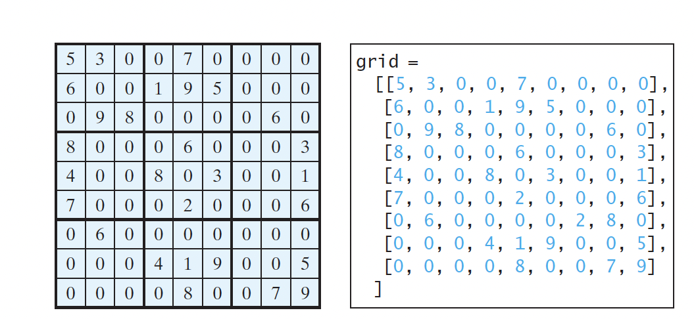

Sudoku is a grid divided into smaller boxes (also called regions or blocks),
Some cells, called fixed cells, are populated with numbers from 1 to 9.
The objective is to fill the empty cells, also called free cells, with the numbers 1 to 9 so that
every row, column, and 3 * 3 box contains the numbers 1 to 9
See examples at https://sudoku.com/

For convenience, we use the value 0 to indicate a free cell. The
grid can be naturally represented using a two-dimensional list, as shown in in the image below.
To find a solution for the puzzle, we must replace each 0 in the grid with an appropriate
number from 1 to 9.

Suppose a solution to a Sudoku puzzle is entered. How do you determine whether the solution
is correct? Here are two approaches:
- One way to check the solution is to verify that every row, column, and box has the
numbers from 1 to 9.
- The other way is to check each cell. Each cell must contain a number from 1 to 9,
and the cell must be unique in every row, column, and box.

Write a program that prompts a user to enter a solution and reports whether it is
valid.